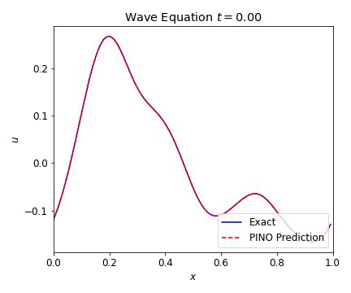
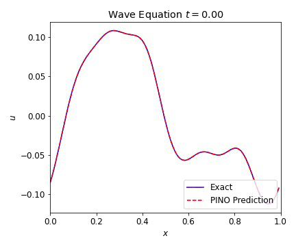

# PINO Applications

In this work, we examine the applications of physics informed neural operators (PINOs).  PINOs have demonstrated excellent ability to reproduce results of various test simulations.  Here we stress test PINOs over a wide range of problems including the variations of the wave equation, Burgers equation and the shallow water equations.  The source code for this work can be found at [this repo](https://github.com/shawnrosofsky/PINO_Applications). 
We also provide users with a way to try out our code at Argonne's [Data and Learning Hub for Science](https://www.dlhub.org).

## Abstract

## Methods

## Results

### Wave Equation 1D
The 1D wave equation was the first test for our PINOs.  This equation computationally simple PDE that is second order in time and models a variety of different physics phenomena.  This equation is given by


where c=1 is our wave speed and with periodic boundary conditions.  

We present results bellow illustrating the ability of the PINO to reconstruct the simulated result for multiple initial conditions.  The differences between the simulated data and the PINO are visually indistinguishable.

  


### Wave Equation 2D
We then extended the wave equation into 2D to assess the performance into 2D.  This allow us to explore the requirements for adding the additional spatial dimension.  In 2D, the wave equation becomes

$$
\begin{align}
    u_{tt} \left( x,t \right) + c^2 u_{xx}\left( x,t \right)&=0, \quad x\in \left[ 0,1 \right),\ t\in \left[0, 1 \right] \label{eq:wave1d}\\
    u\left( x, 0 \right) &= u_0\left(x\right)\,,
\end{align}
$$

where $c=1$ is the speed of the wave.

We present result bellow demonstrating the PINO reconstructing results for the wave equation in 2D and comparing it to the simulated data as well as the error.


<!--  -->

### Burgers Equation 1D
  

### Burgers Equation 2D Scalar

<!--  -->

### Burgers Equation 2D Inviscid

<!--  -->

### Burgers Equation 2D Vector


<!-- ### Linear Shallow Water Equations 2D


 -->

### Nonlinear Shallow Water Equations 2D


<!-- Markdown is a lightweight and easy-to-use syntax for styling your writing. It includes conventions for

```markdown
Syntax highlighted code block

# Header 1
## Header 2
### Header 3

- Bulleted
- List

1. Numbered
2. List

**Bold** and _Italic_ and `Code` text

[Link](url) and 
```
 -->
